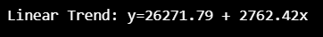
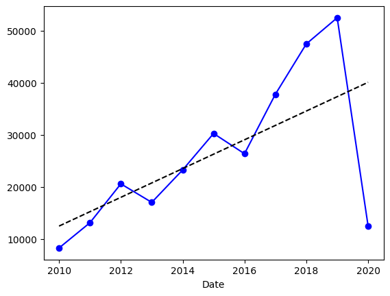
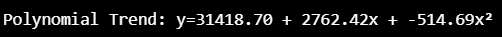
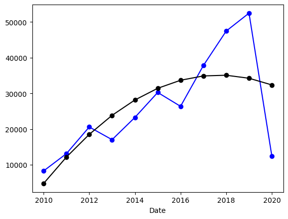

# Ex.No: 02 LINEAR AND POLYNOMIAL TREND ESTIMATION

# Date: 21/4/2026

# AIM:
To Implement Linear and Polynomial Trend Estiamtion Using Python.

### ALGORITHM:

1. Import necessary libraries (NumPy, Matplotlib)

2. Load the dataset

3. Calculate the linear trend values using least square method

4. Calculate the polynomial trend values using least square method


# PROGRAM:

```
resampled_data = df['Close/Last'].resample('Y').sum().to_frame()
resampled_data.head()

resampled_data.index = resampled_data.index.year
resampled_data.reset_index(inplace=True)
resampled_data.rename(columns={'Month': 'Year'}, inplace=True)
resampled_data.head()

years = resampled_data['Date'].tolist()
passengers = resampled_data['Close/Last'].tolist()
```
## LINEAR TREND ESTIMATION
```
X = [i - years[len(years) // 2] for i in years]
x2 = [i ** 2 for i in X]
xy = [i * j for i, j in zip(X, passengers)]
n = len(years)
b = (n * sum(xy) - sum(passengers) * sum(X)) / (n * sum(x2) - (sum(X) ** 2))
a = (sum(passengers) - b * sum(X)) / n
linear_trend = [a + b * X[i] for i in range(n)]
```
## POLYNOMIAL TREND ESTIMATION
```
x3 = [i ** 3 for i in X]
x4 = [i ** 4 for i in X]
x2y = [i * j for i, j in zip(x2, passengers)]
coeff = [[len(X), sum(X), sum(x2)],
[sum(X), sum(x2), sum(x3)],
[sum(x2), sum(x3), sum(x4)]]
Y = [sum(passengers), sum(xy), sum(x2y)]
A = np.array(coeff)
B = np.array(Y)
solution = np.linalg.solve(A, B)
a_poly, b_poly, c_poly = solution
poly_trend = [a_poly + b_poly * X[i] + c_poly * (X[i] ** 2) for i in range(n)]
```
## Plot
```
print(f"Linear Trend: y={a:.2f} + {b:.2f}x")
print(f"\nPolynomial Trend: y={a_poly:.2f} + {b_poly:.2f}x + {c_poly:.2f}x²")
resampled_data['Linear Trend'] = linear_trend
resampled_data['Polynomial Trend'] = poly_trend
resampled_data.set_index('Date',inplace=True)
resampled_data['Close/Last'].plot(kind='line',color='blue',marker='o') #alpha=0.3 makes 
resampled_data['Linear Trend'].plot(kind='line',color='black',linestyle='--')
resampled_data['Close/Last'].plot(kind='line',color='blue',marker='o')
resampled_data['Polynomial Trend'].plot(kind='line',color='black',marker='o')
```

# OUTPUT
## LINEAR TREND ESTIMATION




## POLYNOMIAL TREND ESTIMATION



### RESULT:
Thus the python program for linear and Polynomial Trend Estiamtion has been executed successfully.
